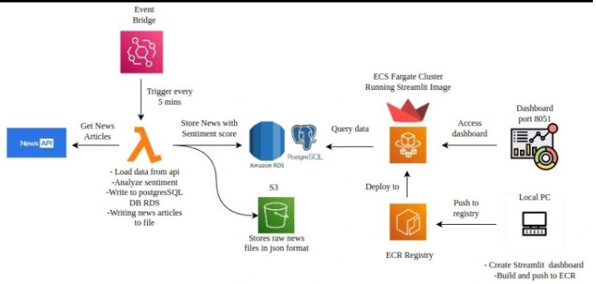
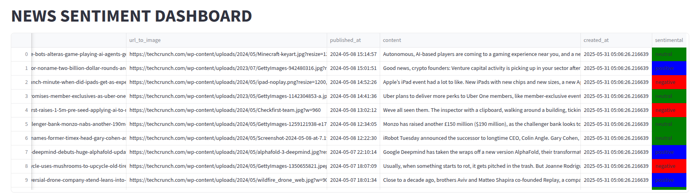

# 📰 News Sentiment Analysis Dashboard

This project extracts real-time technology news headlines from TechCrunch using AWS Lambda, stores them in Amazon S3 and PostgreSQL RDS, performs sentiment analysis using Streamlit and TextBlob, and visualizes the results in a containerized Streamlit dashboard deployed on Amazon ECS using Docker images stored in Amazon ECR.

# 🔧 Technologies Used

🧠 AWS Lambda – Fetches and sends news data.

🪣 Amazon S3 – Stores raw news data.

🐘 Amazon RDS (PostgreSQL) – Stores cleaned and processed news.

🐳 Docker – Containerizes the Streamlit dashboard.

🚢 Amazon ECS & ECR – Hosts and manages the Streamlit app container.

📊 Streamlit – Interactive UI for sentiment analysis.

🧾 TextBlob – Performs sentiment classification.

# 🔄 Data Pipeline Flow

1.Lambda Function pulls headlines from the News API.

2.The data is stored in both Amazon S3 and PostgreSQL RDS.

3.A Streamlit dashboard reads from RDS.

4.TextBlob performs real-time sentiment analysis.

5.The results are visualized and color-coded in the dashboard.

6.The app is deployed in a Docker container using ECS via ECR.

# 🧠 Sentiment Classification

| Polarity Score | Sentiment |
| -------------- | --------- |
| > 0            | Positive  |
| = 0            | Neutral   |
| < 0            | Negative  |

Color scheme in dashboard:

🔵 Positive: Blue

🟢 Neutral: Green

🔴 Negative: Red

# 📂 Project Files

- [`news_lambda.py`](news_lambda.py) — AWS Lambda code that fetches headlines, creates the PostgreSQL table if it doesn’t exist, and pushes data to S3 and RDS.
- [`app.py`](app.py) — Streamlit dashboard application for sentiment analysis and visualization.
- [`Dockerfile`](Dockerfile) — Docker configuration to containerize the Streamlit app.
- [`requirements.txt`](requirement.txt) — Python dependencies required for both Lambda and Streamlit app.

# 🛠 Setup Instructions

# AWS Credentials
Configure AWS access keys with appropriate permissions for Lambda, S3, and RDS.

| Variable Name        | Description                                              |
| -------------------- | -------------------------------------------------------- |
| `TECHCRUNCH_API_KEY` | API key for accessing TechCrunch news headlines          |
| `S3_BUCKET_NAME`     | Name of the S3 bucket to store raw news data             |
| `RDS_ENDPOINT`       | PostgreSQL RDS endpoint (e.g., `xxxx.rds.amazonaws.com`) |
| `RDS_USER`           | PostgreSQL username                                      |
| `RDS_PASSWORD`       | PostgreSQL password                                      |

# PostgreSQL (RDS) Setup

The Lambda function automatically creates the table in PostgreSQL if it doesn't exist.

Ensure:

* The RDS instance is publicly accessible or within the same VPC/subnet as Lambda.

* Security group inbound rules allow traffic from Lambda (usually port 5432).

* The database exists (Lambda creates the table, not the database itself).

# Streamlit Dashboard

* Containerize the Streamlit app using Docker (Dockerfile provided).

* Push the image to Amazon ECR.

* Deploy it on Amazon ECS using a task definition and Fargate service.

# Automation
* Use Amazon EventBridge (CloudWatch) to trigger the Lambda every 5 minutes.

* ECS service runs continuously to serve the dashboard.

# Security Considerations

 Always secure your API keys, database credentials, and AWS access keys using environment variables or secrets managers. Avoid hardcoding sensitive data in source code or public repositories.

# 🏗 Architecture Overview

# 📝 Summary
This solution demonstrates a fully automated, cloud-native pipeline to monitor and analyze tech news sentiment in real time. By leveraging AWS Lambda, PostgreSQL, Amazon S3, Amazon ECR, Streamlit, and Amazon ECS, it delivers actionable insights with minimal manual intervention. The modular setup allows easy customization for different news sources or analytics models.

# 🖼️ Architecture Diagram

  
Figure: architecture of the end-to-end pipeline

# 📊 Dashboard Preview

Figure: Real-time sentiment dashboard built with Streamlit and deployed via ECS
